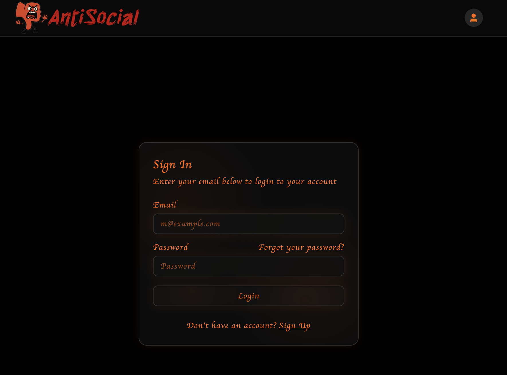

# AntiSocial

AntiSocial is a unique social media platform that flips the traditional social media model on its head. Instead of promoting positivity and happiness, AntiSocial encourages users to express their frustrations, annoyances, and negative thoughts.

## Core Concept

*"Where negativity is encouraged and positivity is tolerated (barely)."*

AntiSocial provides a refreshing contrast to conventional social platforms by creating a space where users can vent their frustrations without the pressure of maintaining a perfect online persona.

## Key Features

### Rants, Not Posts
Users create "rants" instead of posts, allowing them to express their deepest frustrations. The platform discourages sharing vacation photos or other traditionally "positive" content.

### Dislike-Driven Content
Content is ranked based on negative reactions:
- Content with more dislikes gets more visibility
- Super-dislikes give posts priority placement
- The platform features a "Most Disliked" sorting option

### Fresh Negativity
Users must post a rant before browsing, ensuring the platform maintains a steady stream of fresh complaints. This is enforced each time users log in.

### Reaction System
Three ways to express feelings:
- 👍 Like (for content you appreciate)
- 👎 Dislike (for content that annoys you)
- 🖕 Super Dislike (for content that truly offends you)

### Comments
Users can leave comments on rants, typically continuing the negative theme.

### Stalking Feature
Users can "stalk" other users to see their rants regularly in a dedicated feed called "Annoyances."

## Screenshots

### Welcome Page

Introduction screen that explains the concept and requires new users to create their first rant to continue.

### Sign In Page

Login screen with email and password fields, along with options to recover password or sign up.

### Feed

Main timeline showing rants from various users with interaction options (like, dislike, super dislike).

### Landing Page

Explains how the platform works with its three key principles: Rants Not Posts, Dislikes > Likes, and Fresh Negativity.

### Notifications

Shows new rants from users you stalk under the "Annoyances" section.

### Post Comments

Individual rant view with comments section below and reaction buttons.

### Search

Search interface to find posts and users with tabs for filtering results.

### User Page

Profile page showing user stats and their rants, sorted by most disliked.

## Project Structure

```
antisocial-app/
├── app/                # Application code
├── public/             # Static assets
├── screenshots/        # Application screenshots
│   ├── feed.png
│   ├── landing.png
│   ├── notifications.png
│   ├── post-comments.png
│   ├── search.png
│   ├── sign-in.png
│   ├── user-page.png
│   └── welcome.png
└── README.md           # This file
```

## Pages

### Welcome
New users are greeted with an explanation of how AntiSocial works and are required to post their first rant before proceeding.

### Sign In
Users can log in with their email and password or create a new account.

### Feed
The main timeline displays rants from various users, sorted by dislike count by default.

### Notifications
Updates about activity related to your content or users you stalk.

### Post and Comments
Individual rant view with comment section for users to respond.

### User Profile
Displays user information including stalker count, stalking count, and rant count, along with their rants.

### Search
Find specific content or users by keyword.

## Design

AntiSocial features a distinctive dark theme with orange/red accents that reinforces its contrarian attitude. Our angry dislike button mascot, Boo, visually represents the platform's focus on expressing negative emotions.


## Purpose

AntiSocial serves as a satirical commentary on traditional social media, providing a space where users can be authentic about their negative feelings rather than projecting an artificially positive image. 